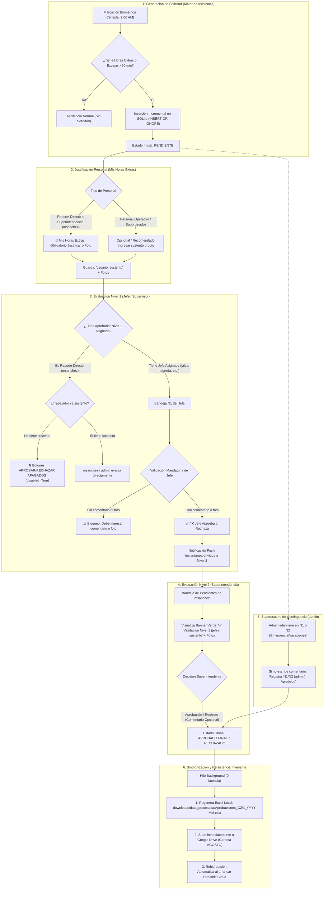

# Sistema de Asistencia y Aprobaciones GZG: Arquitectura y Reglas del Flujo de Aprobaciones

---

## 1. Diagrama de Flujo del Proceso de Aprobaciones (End-to-End)

---

## 2. Matriz de Roles y Reglas de Validación (RBAC)

| Rol | Usuario Ejemplo | Sustento / Comentario | Regla de Bloqueo | Visibilidad de Bandeja |
| :--- | :--- | :--- | :--- | :--- |
| **`PERSONAL`** *(Trabajador)* | `respinoza`, `lpretel`, `jsanchez` | **100% Mandatorio** (comentario o foto) | No puede enviar solicitud vacía en *Mis Horas Extras*. | Solo ve su propia pestaña *Mis Horas Extras*, Historial y Dashboard. |
| **`JEFE` / `SUPERVISOR`** *(Nivel 1)* | `jalva`, `jagreda`, `jdelariva`, `jhuayama` | **100% Mandatorio** (comentario o foto) | No puede aprobar ni rechazar a subordinados sin dejar justificación. | Solo ve las solicitudes de trabajadores asignados bajo su cargo en el Padrón. |
| **`SUPERINTENDENTE`** *(Nivel 2)* | `msanchez` | **Opcional** (1 clic) | Botones **APAGADOS (`disabled=True`)** para personal con reporte directo si no han sustentado en *Mis Horas Extras*. | Ve a sus subordinados directos y las solicitudes validadas por Jefes Nivel 1. |
| **`ADMINISTRADOR`** *(Superusuario)* | `admin` | **Opcional** (1 clic) | **Cero Bloqueos** (Capacidad de aprobación y contingencia universal). | Acceso irrestricto al 100% de solicitudes de todas las áreas de la empresa. |

---

## 3. Consideraciones y Reglas Maestras Implementadas

### A. Reglas de Negocio en la Aplicación Móvil PWA
1. **Reporte Directo a Superintendencia (`msanchez`)**:
   - Todo trabajador o jefe cuyo reporte sea directo a `msanchez` (sin supervisor intermedio) requiere obligatoriamente que el trabajador registre primero su sustento en **`📝 Mis Horas Extras`**.
   - Si no hay sustento, en la bandeja de `msanchez` los botones `APROBAR` y `RECHAZAR` permanecen **estrictamente apagados (`disabled=True`)** con un recuadro de advertencia roja.
2. **Visualización de Sustento Nivel 1 en Bandeja N2**:
   - El Superintendente ve obligatoriamente el recuadro verde con la validación de Nivel 1:
     `✅ Validación Nivel 1 (jalva / admin): <comentario real o Aprobado>`.
   - Las fotos adjuntadas por el supervisor y por el trabajador se visualizan en galería antes de los botones de acción.
3. **Auditoría Automática de `admin`**:
   - Cuando `admin` aprueba o rechaza sin escribir texto manual, el sistema genera automáticamente el registro de auditoría `N1 (admin): Aprobado` o `N2 (admin): Aprobado` (o `Rechazado`) en SQLite, en el Excel Columna S y en el Historial.
4. **Identificación de Autor en Sustentos Personales**:
   - Cuando un trabajador o jefe ingresa su justificación personal en *Mis Horas Extras*, en la Columna S del Excel oficial y en el Historial se antepone automáticamente su usuario (ej. `jalva: Trabajos en mina`, `respinoza: Mantenimiento de bombas`).
5. **Sanitización Total del Historial**:
   - Cero textos `"nan"`, `"none"` o `"null"`. Los nombres de los aprobadores se resuelven con fallback limpio hacia el aprobador asignado en el padrón o a `admin`.
6. **Diseño de Interfaz PWA**:
   - **3 Cajones KPI Simétricos**: `Pendientes` (Naranja), `Aprobadas` (Celeste) y `Rechazadas` (Rojo) en una sola fila horizontal en todas las vistas.
   - **Alertas de Validación Limpias**: Cero cajas de advertencia estáticas dentro de las tarjetas; las alertas se ubican debajo de ambos botones a todo el ancho.

---

### B. Reglas de Persistencia, Nube y Sincronización
1. **Blindaje contra Reinicios de Servidor / Contenedor en Streamlit Cloud**:
   - Al iniciar sesión en `mobile.py`, el sistema ejecuta `sincronizar_aprobaciones_con_gdrive()` utilizando credenciales de `st.secrets["gcp_service_account"]`.
   - Si Streamlit Cloud se reconstruye, descarga el archivo oficial `Aprobaciones_GZG_YYYY-MM.xlsx` de Google Drive y restaura en la base de datos local SQLite todos los estados aprobados, rechazados y comentarios.
2. **Cero Reinicios no Autorizados**:
   - Queda terminantemente prohibido reiniciar contadores o solicitudes en la base de datos o en los archivos Excel sin orden explícita y textual del usuario.
   - La inserción diaria de solicitudes a las 9:00 AM es **estrictamente incremental (`INSERT OR IGNORE`)**.
3. **Subida Inmediata en Hilo Background (`threading.Thread`)**:
   - Cada vez que un aprobador valida o rechaza en el celular, el Excel oficial se regenera con encabezados `#1F4E78` y se sube de inmediato a Google Drive en segundo plano, garantizando cero bloqueos y tiempo de respuesta instantáneo.
4. **Inmutabilidad del Padrón Oficial**:
   - `Padron_Trabajadores_GZG.xlsx` en la raíz del proyecto es de **estricta solo lectura**.
